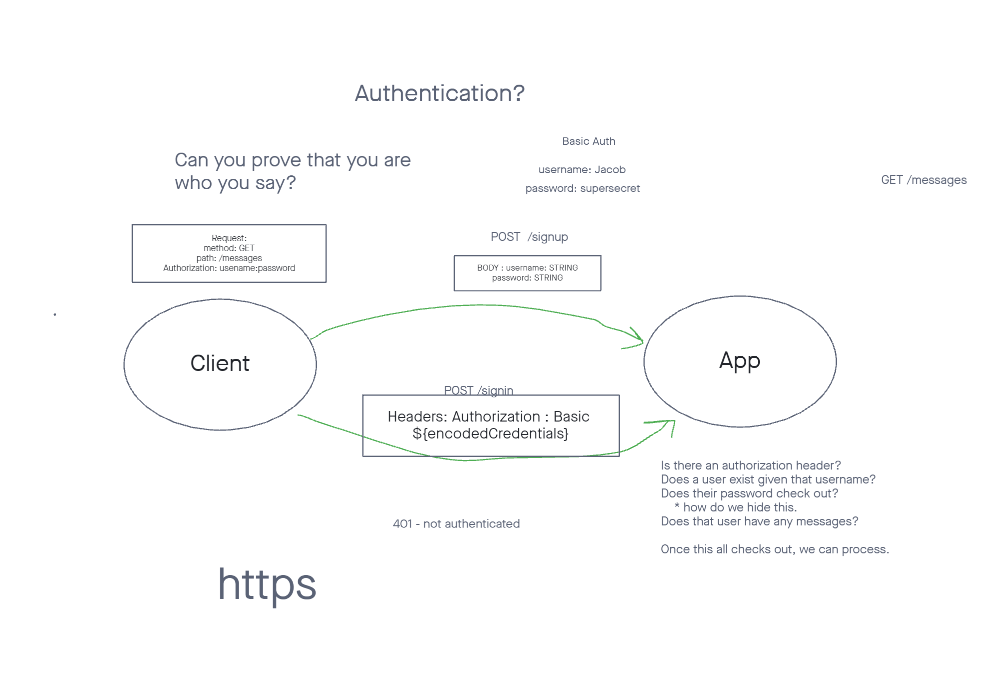

# LAB: Authentication

Authentication System Phase 1: Deploy an Express server that implements Basic Authentication, with signup and signin capabilities, using a Postgres database for storage.



``` JavaScript

'use strict';

// npm i base-64, bcrypt, cors, pg, sequelize, sqlite3 and such

// start making server.js

```
